# Experiment 2: DDL Commands

## AIM
To study and implement DDL commands and different types of constraints.

## THEORY

### 1. CREATE
Used to create a new relation (table).

**Syntax:**
```sql
CREATE TABLE (
  field_1 data_type(size),
  field_2 data_type(size),
  ...
);
```
### 2. ALTER
Used to add, modify, drop, or rename fields in an existing relation.
(a) ADD
```sql
ALTER TABLE std ADD (Address CHAR(10));
```
(b) MODIFY
```sql
ALTER TABLE relation_name MODIFY (field_1 new_data_type(size));
```
(c) DROP
```sql
ALTER TABLE relation_name DROP COLUMN field_name;
```
(d) RENAME
```sql
ALTER TABLE relation_name RENAME COLUMN old_field_name TO new_field_name;
```
### 3. DROP TABLE
Used to permanently delete the structure and data of a table.
```sql
DROP TABLE relation_name;
```
### 4. RENAME
Used to rename an existing database object.
```sql
RENAME TABLE old_relation_name TO new_relation_name;
```
### CONSTRAINTS
Constraints are used to specify rules for the data in a table. If there is any violation between the constraint and the data action, the action is aborted by the constraint. It can be specified when the table is created (using CREATE TABLE) or after it is created (using ALTER TABLE).
### 1. NOT NULL
When a column is defined as NOT NULL, it becomes mandatory to enter a value in that column.
Syntax:
```sql
CREATE TABLE Table_Name (
  column_name data_type(size) NOT NULL
);
```
### 2. UNIQUE
Ensures that values in a column are unique.
Syntax:
```sql
CREATE TABLE Table_Name (
  column_name data_type(size) UNIQUE
);
```
### 3. CHECK
Specifies a condition that each row must satisfy.
Syntax:
```sql
CREATE TABLE Table_Name (
  column_name data_type(size) CHECK (logical_expression)
);
```
### 4. PRIMARY KEY
Used to uniquely identify each record in a table.
Properties:
Must contain unique values.
Cannot be null.
Should contain minimal fields.
Syntax:
```sql
CREATE TABLE Table_Name (
  column_name data_type(size) PRIMARY KEY
);
```
### 5. FOREIGN KEY
Used to reference the primary key of another table.
Syntax:
```sql
CREATE TABLE Table_Name (
  column_name data_type(size),
  FOREIGN KEY (column_name) REFERENCES other_table(column)
);
```
### 6. DEFAULT
Used to insert a default value into a column if no value is specified.

Syntax:
```sql
CREATE TABLE Table_Name (
  col_name1 data_type,
  col_name2 data_type,
  col_name3 data_type DEFAULT 'default_value'
);
```

**Question 1**

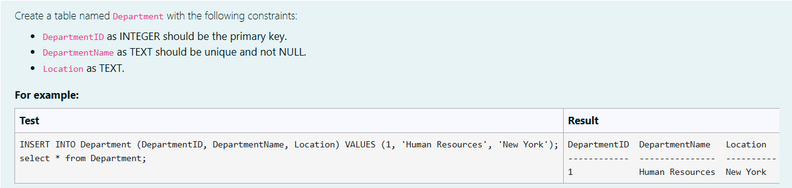

```sql
CREATE TABLE Department(
    DepartmentID INT PRIMARY KEY,
    DepartmentName TEXT NOT NULL UNIQUE,
    Location TEXT
);
```

**Output:**

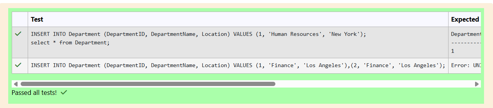

**Question 2**

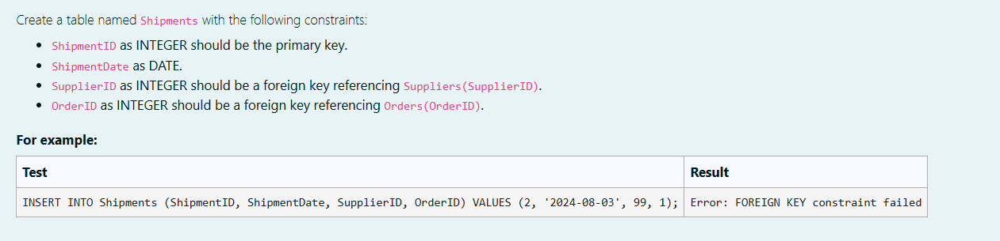

```sql
CREATE TABLE Shipments(
    ShipmentID INTEGER PRIMARY KEY,
    ShipmentDate DATE,
    SupplierID INTEGER NOT NULL,
    OrderID INTEGER NOT NULL,
    FOREIGN KEY (SupplierID) REFERENCES Suppliers(SupplierID),
    FOREIGN KEY (OrderID) REFERENCES Orders(OrderID)
);
```

**Output:**

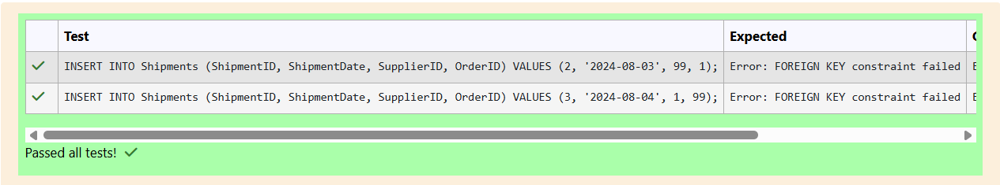

**Question 3**

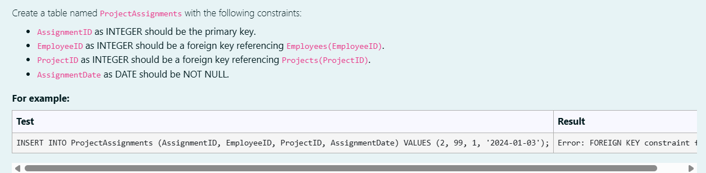

```sql
CREATE TABLE ProjectAssignments(
    AssignmentID INTEGER PRIMARY KEY,
    EmployeeID INTEGER NOT NULL,
    ProjectID INTEGER NOT NULL,
    AssignmentDate DATE NOT NULL,
    FOREIGN KEY (EmployeeID) REFERENCES Employees(EmployeeID),
    FOREIGN KEY (ProjectID) REFERENCES Projects(ProjectID)
);
```

**Output:**

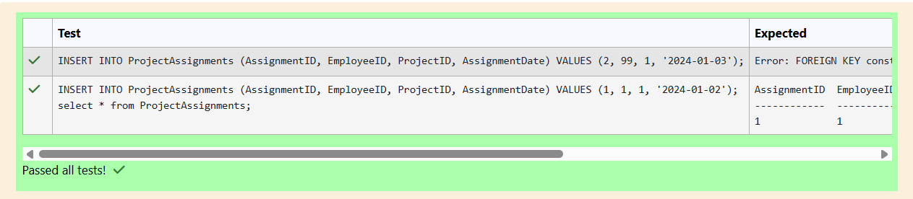

**Question 4**

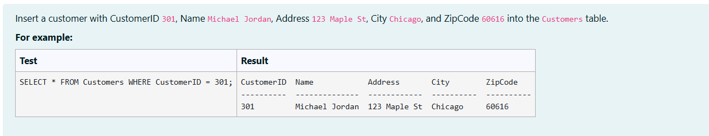

```sql
INSERT INTO Customers 
VALUES("301","Michael Jordan","123 Maple St","Chicago",60616);
```

**Output:**

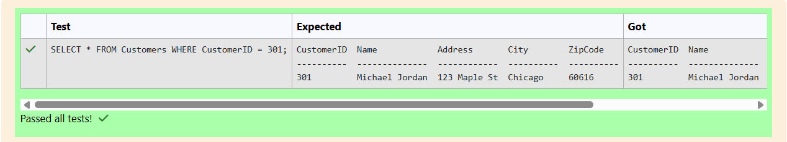

**Question 5**

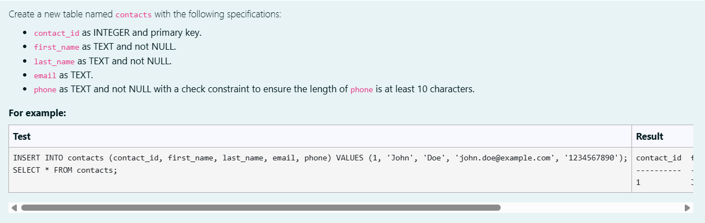

```sql
CREATE TABLE contacts(
    contact_id INTEGER PRIMARY KEY,
    first_name TEXT NOT NULL,
    last_name TEXT NOT NULL,
    email TEXT,
    phone TEXT NOT NULL,
    CHECK(LENGTH(phone)>=10)
);
```

**Output:**

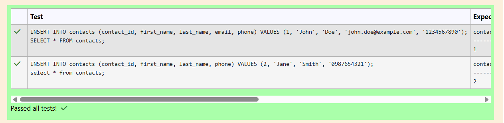

**Question 6**

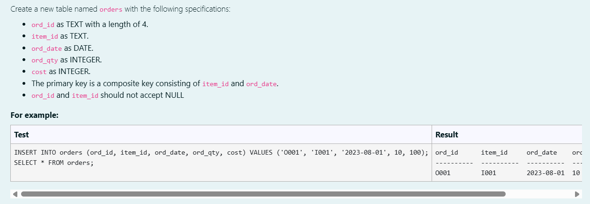

```sql
CREATE TABLE orders(
    ord_id TEXT NOT NULL,
    item_id TEXT NOT NULL,
    ord_date DATE,
    ord_qty INTEGER,
    cost INTEGER,
    PRIMARY KEy(item_id,ord_date)
    CHECK(LENGTH(ord_id)=4)
);
```

**Output:**

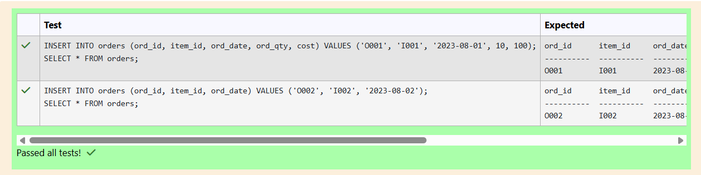

**Question 7**

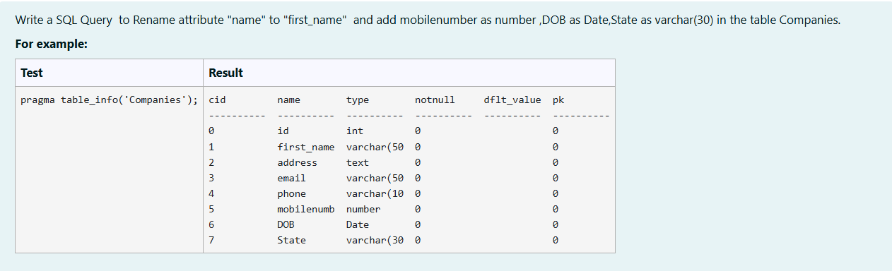

```sql
ALTER TABLE Companies RENAME COLUMN name TO first_name;

ALTER TABLE Companies ADD COLUMN mobilenumber number;

ALTER TABLE Companies ADD COLUMN DOB Date;

ALTER TABLE Companies ADD COLUMN State varchar(30);
```

**Output:**

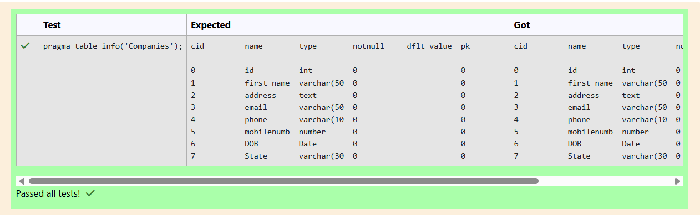

**Question 8**

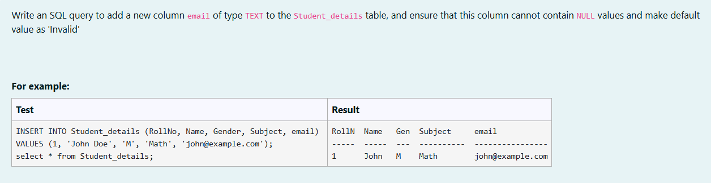

```sql
ALTER TABLE Student_details
ADD COLUMN email TEXT NOT NULL DEFAULT 'Invalid';
```

**Output:**


**Question 9**


```sql
INSERT INTO Student_details
SELECT * FROM Archived_students;
```

**Output:**


**Question 10**


```sql
INSERT INTO Employee (EmployeeID,Name,Position,Department,Salary)
VALUES("001","Sarah Parker","Manager","HR",60000);
```

**Output:**

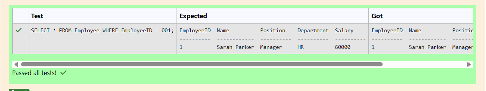


## RESULT
Thus, the SQL queries to implement different types of constraints and DDL commands have been executed successfully.
