# Experiment 3: DML Commands

## AIM
To study and implement DML (Data Manipulation Language) commands.

## THEORY

### 1. INSERT INTO
Used to add records into a relation.
These are three type of INSERT INTO queries which are as
A)Inserting a single record
**Syntax (Single Row):**
```sql
INSERT INTO table_name (field_1, field_2, ...) VALUES (value_1, value_2, ...);
```
**Syntax (Multiple Rows):**
```sql
INSERT INTO table_name (field_1, field_2, ...) VALUES
(value_1, value_2, ...),
(value_3, value_4, ...);
```
**Syntax (Insert from another table):**
```sql
INSERT INTO table_name SELECT * FROM other_table WHERE condition;
```
### 2. UPDATE
Used to modify records in a relation.
Syntax:
```sql
UPDATE table_name SET column1 = value1, column2 = value2 WHERE condition;
```
### 3. DELETE
Used to delete records from a relation.
**Syntax (All rows):**
```sql
DELETE FROM table_name;
```
**Syntax (Specific condition):**
```sql
DELETE FROM table_name WHERE condition;
```
### 4. SELECT
Used to retrieve records from a table.
**Syntax:**
```sql
SELECT column1, column2 FROM table_name WHERE condition;
```
**Question 1**

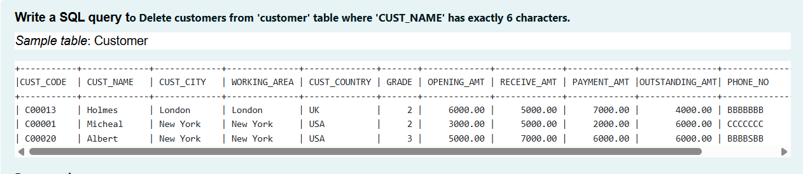

```sql
DELETE FROM Customer
WHERE LENGTH(CUST_NAME) = 6;
```

**Output:**

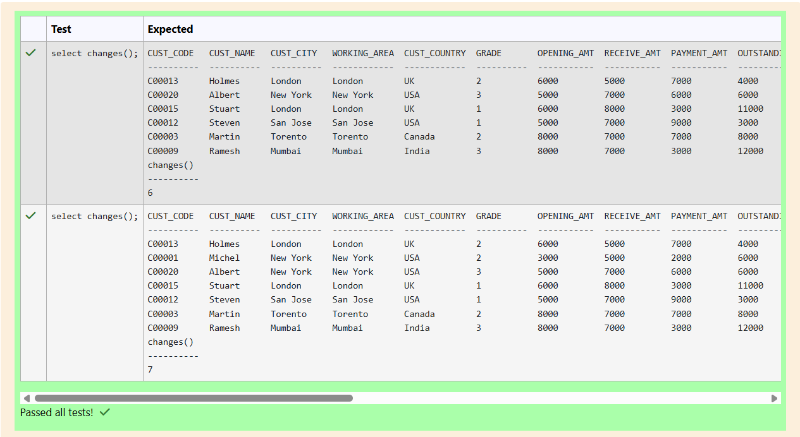

**Question 2**

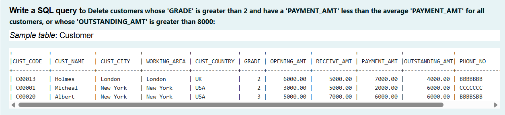

```sql
DELETE FROM Customer
WHERE (GRADE > 2 AND PAYMENT_AMT < (SELECT AVG(PAYMENT_AMT) FROM Customer)) OR OUTSTANDING_AMT > 8000;
```

**Output:**

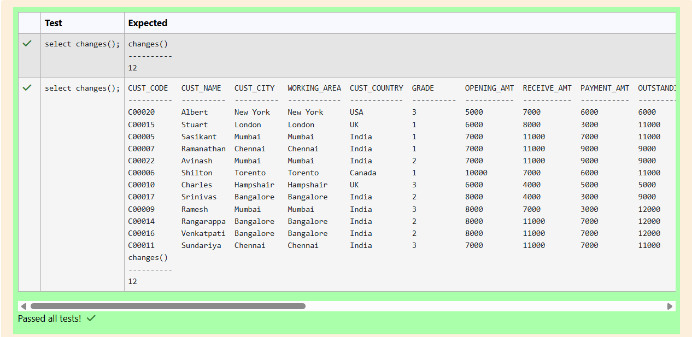

**Question 3**

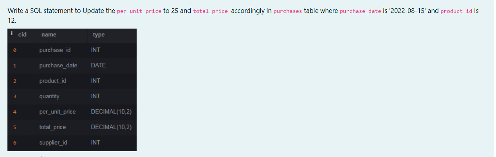

```sql
UPDATE purchases
SET per_unit_price = 25 , total_price = quantity * 25
WHERE purchase_date = '2022-08-15' AND product_id = 12;
```

**Output:**

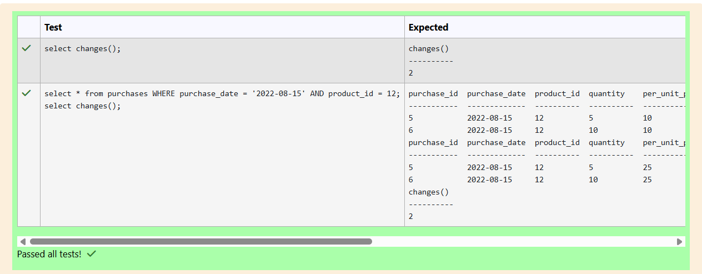

**Question 4**

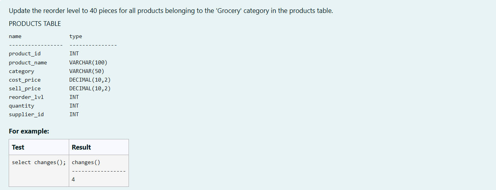

```sql
UPDATE PRODUCTS
SET reorder_lvl = 40
WHERE category = 'Grocery';
```

**Output:**

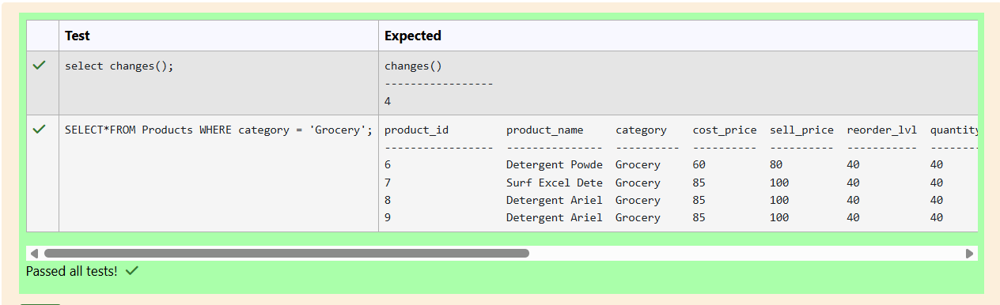

**Question 5**

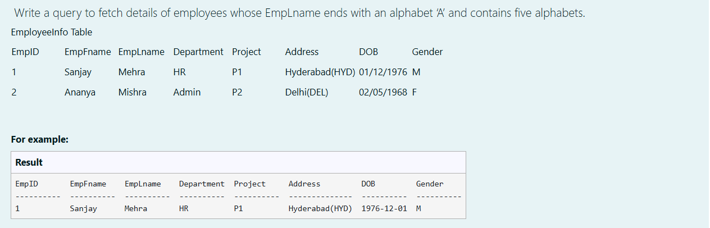

```sql
SELECT * FROM EmployeeInfo
WHERE EmpLname LIKE '%A' AND LENGTH(EmpLname) = 5;
```

**Output:**

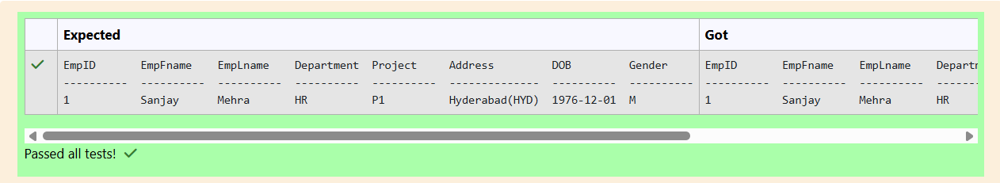

**Question 6**

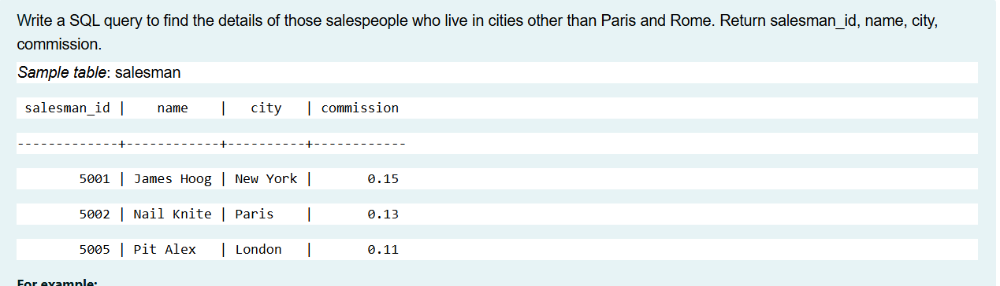

```sql
SELECT salesman_id,name,city,commission
FROM salesman
WHERE city NOT IN ('Paris','Rome');
```

**Output:**

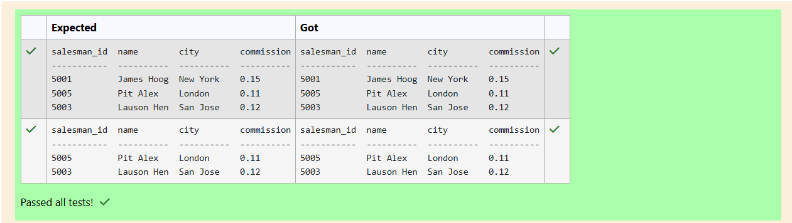

**Question 7**

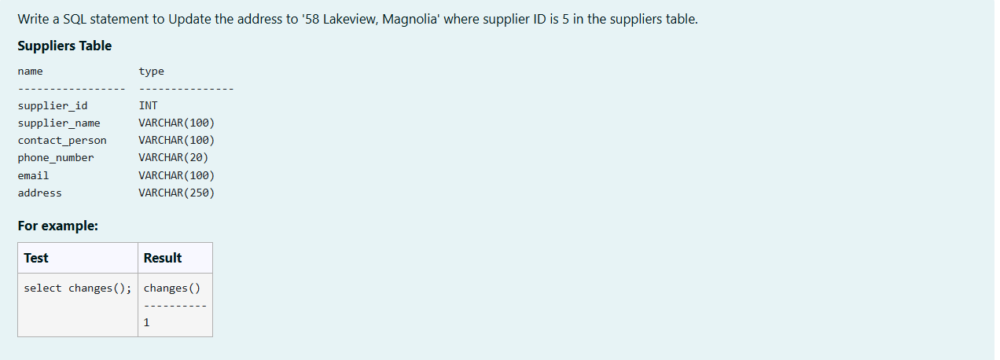

```sql
UPDATE Suppliers
SET address = '58 Lakeview, Magnolia'
WHERE supplier_id = 5;
```

**Output:**

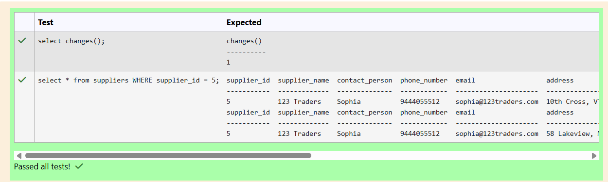

**Question 8**

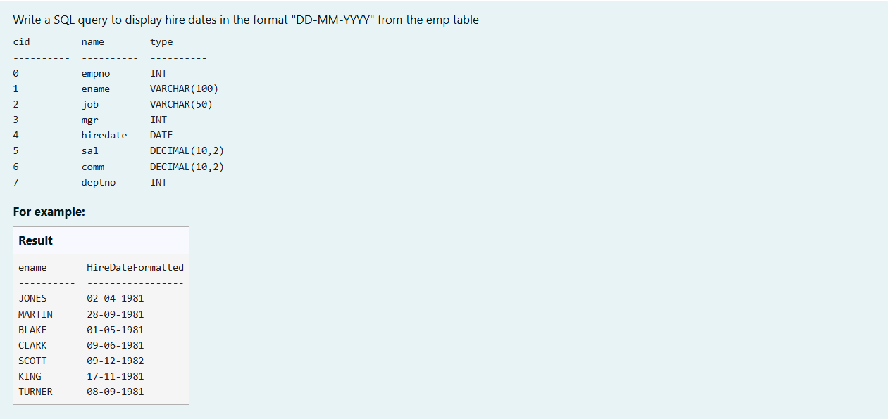

```sql
SELECT 
    ename,
    strftime('%d-%m-%Y',hiredate) AS HireDateFormatted
FROM emp;
```

**Output:**

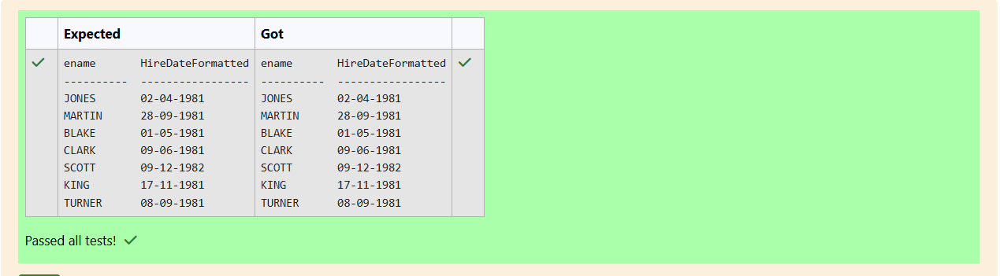


**Question 9**

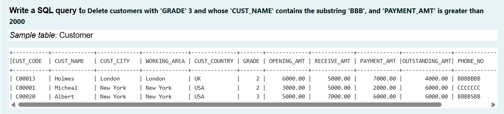

```sql
DELETE FROM Customer
WHERE GRADE = 3 AND CUST_NAME LIKE '%BBB%' AND PAYMENT_AMT > 2000;
```

**Output:**

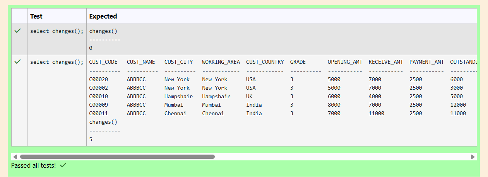

**Question 10**

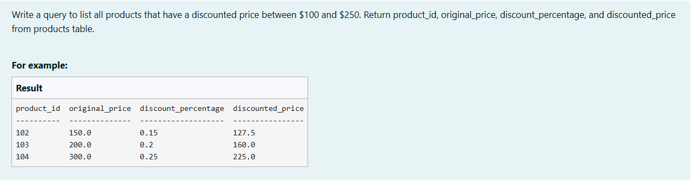

```sql
SELECT
    product_id,
    original_price,
    discount_percentage,
    (original_price - (original_price * discount_percentage)) AS discounted_price
FROM products
WHERE original_price - (original_price * discount_percentage) BETWEEN 100 AND 250;
```

**Output:**

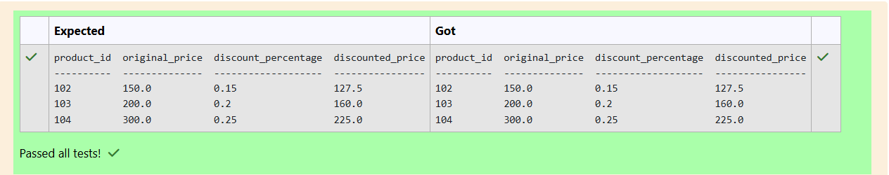

## RESULT
Thus, the SQL queries to implement DML commands have been executed successfully.
