# Experiment 5: Subqueries and Views

## AIM
To study and implement subqueries and views.

## THEORY

### Subqueries
A subquery is a query inside another SQL query and is embedded in:
- WHERE clause
- HAVING clause
- FROM clause

**Types:**
- **Single-row subquery**:
  Sub queries can also return more than one value. Such results should be made use along with the operators in and any.
- **Multiple-row subquery**:
  Here more than one subquery is used. These multiple sub queries are combined by means of ‘and’ & ‘or’ keywords.
- **Correlated subquery**:
  A subquery is evaluated once for the entire parent statement whereas a correlated Sub query is evaluated once per row processed by the parent statement.

**Example:**
```sql
SELECT * FROM employees
WHERE salary > (SELECT AVG(salary) FROM employees);
```
### Views
A view is a virtual table based on the result of an SQL SELECT query.
**Create View:**
```sql
CREATE VIEW view_name AS
SELECT column1, column2 FROM table_name WHERE condition;
```
**Drop View:**
```sql
DROP VIEW view_name;
```

**Question 1**

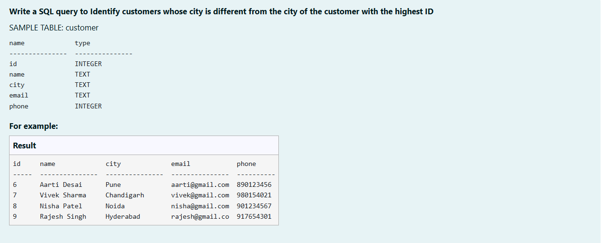

```sql
SELECT * FROM customer
WHERE city <> (SELECT city FROM customer WHERE id = (SELECT MAX(id) FROM customer));
```

**Output:**

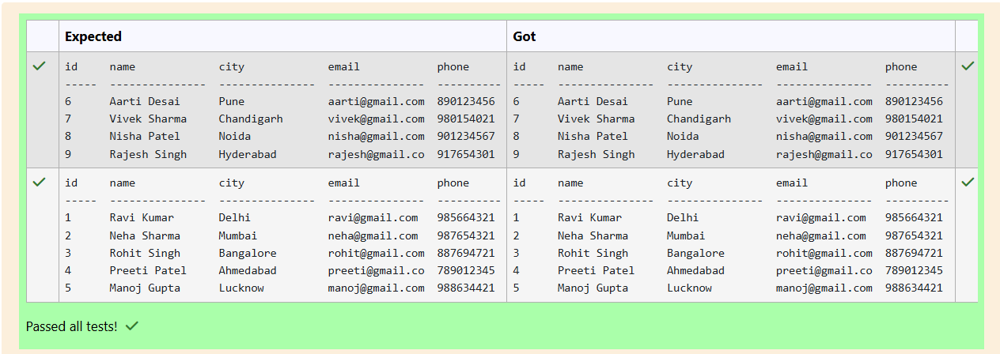

**Question 2**

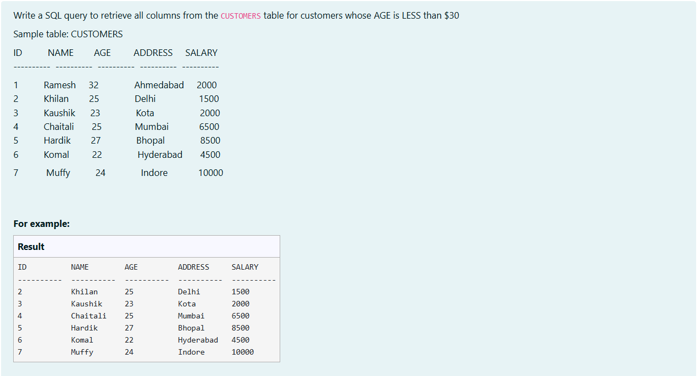

```sql
SELECT *
FROM CUSTOMERS
WHERE AGE < 30;
```

**Output:**

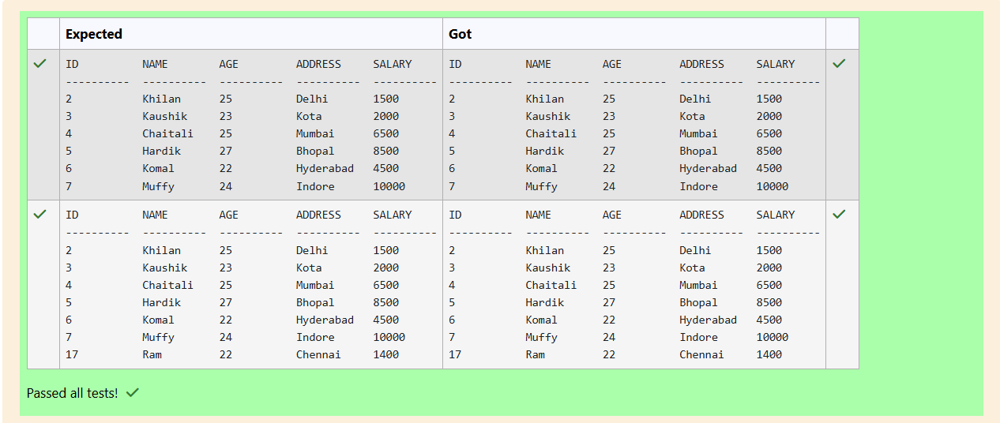

**Question 3**

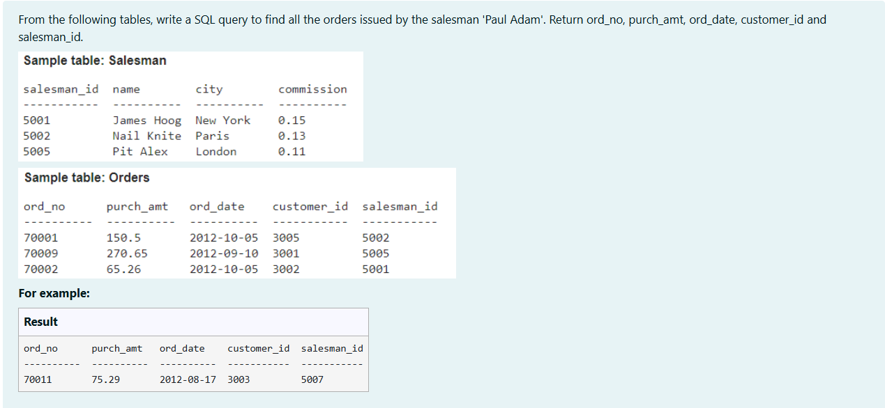

```sql
SELECT o.ord_no,o.purch_amt,o.ord_date,o.customer_id,o.salesman_id
FROM Orders o
JOIN Salesman s ON o.salesman_id = s.salesman_id
WHERE s.name = "Paul Adam";
```

**Output:**

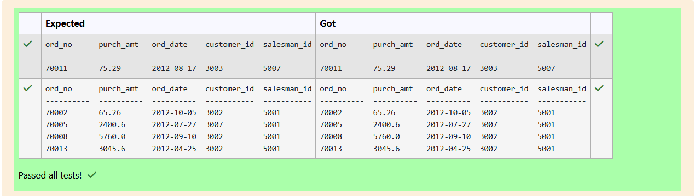

**Question 4**

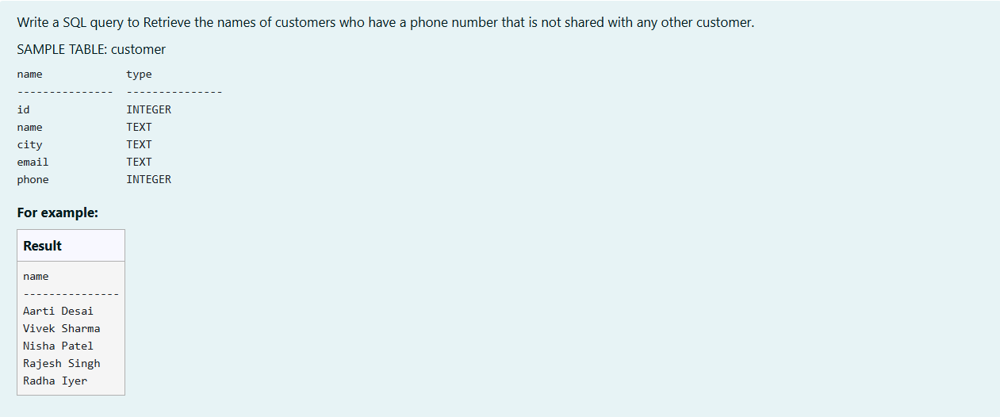

```sql
SELECT name 
FROM customer
WHERE phone IN(
    SELECT phone 
    FROM customer
    GROUP BY phone
    HAVING COUNT(phone) = 1
);
```

**Output:**

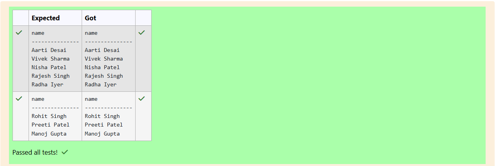

**Question 5**

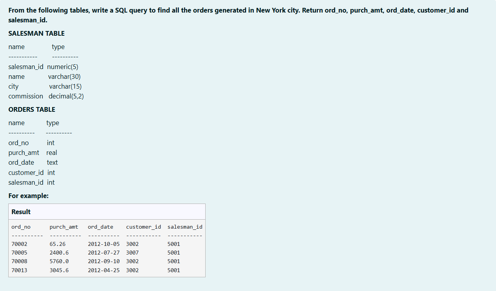

```sql
SELECT
    o.ord_no,
    o.purch_amt,
    o.ord_date,
    o.customer_id,
    o.salesman_id
FROM ORDERS o
JOIN SALESMAN s ON o.salesman_id = s.salesman_id
WHERE s.city = "New York";
```

**Output:**

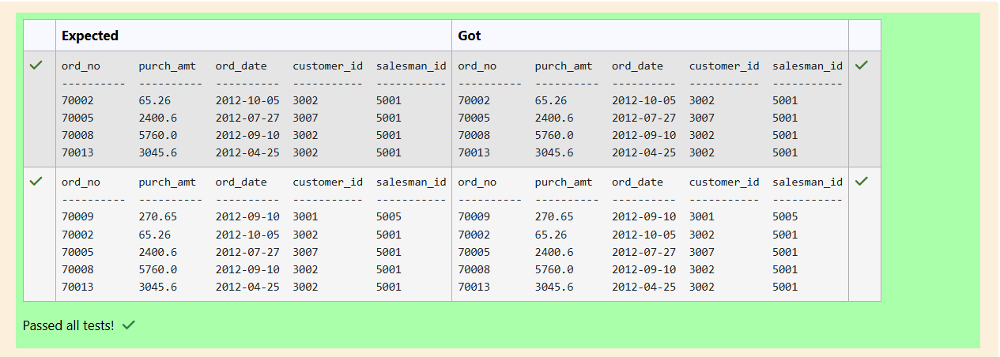

**Question 6**

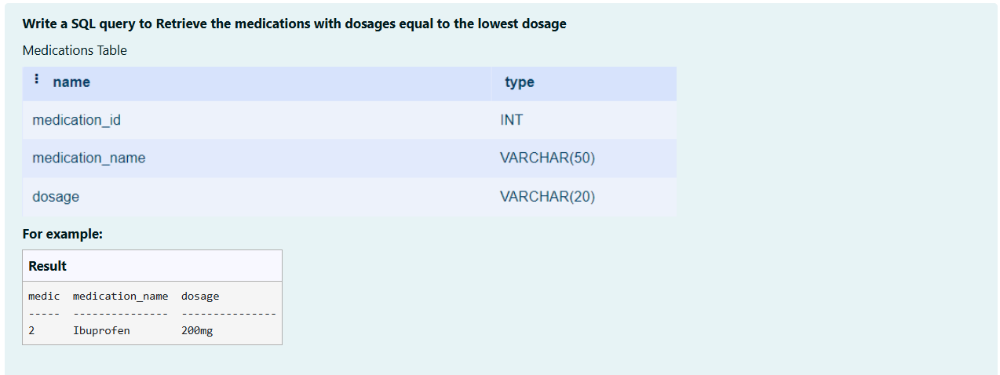

```sql
SELECT *
FROM Medications
WHERE dosage = (SELECT MIN(dosage) FROM Medications);
```

**Output:**

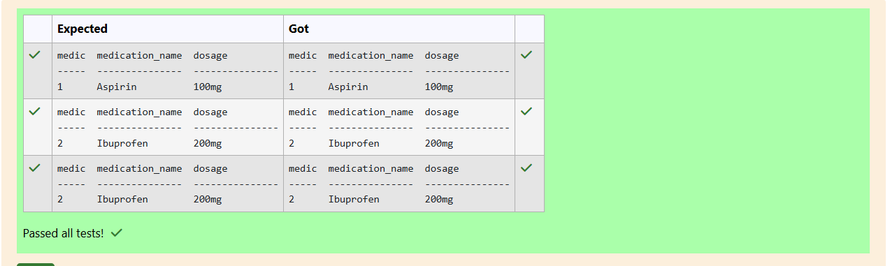

**Question 7**

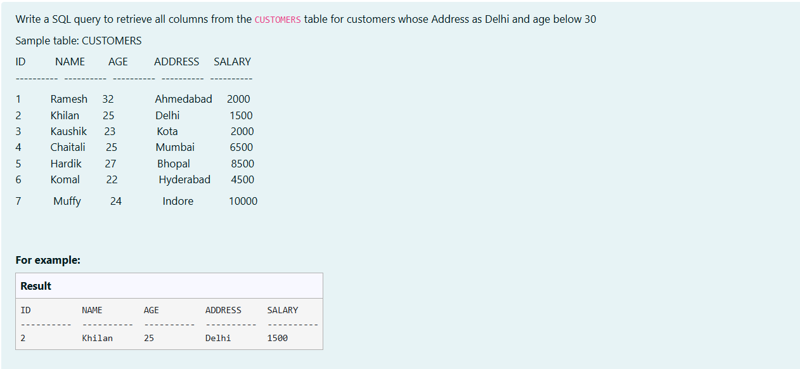

```sql
SELECT *
FROM CUSTOMERS
WHERE (ADDRESS = "Delhi" AND AGE < 30)
ORDER BY ID;
```

**Output:**

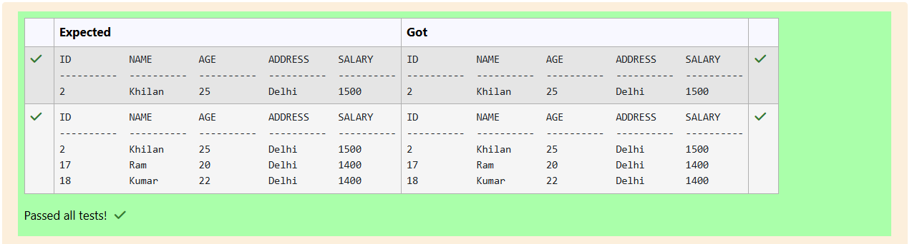

**Question 8**

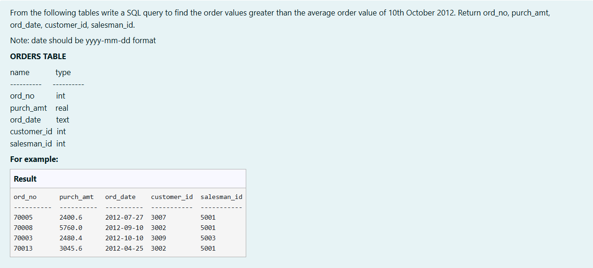

```sql
SELECT *
FROM ORDERS
WHERE purch_amt > (SELECT AVG(purch_amt) FROM ORDERS WHERE ord_date = '2012-10-10');
```

**Output:**

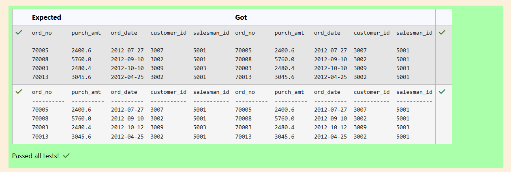

**Question 9**

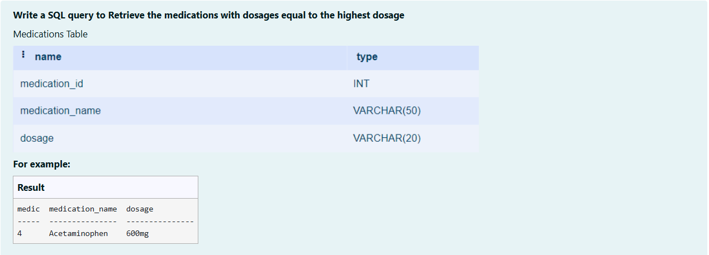

```sql
SELECT * 
FROM Medications
WHERE dosage = (SELECT MAX(dosage) FROM Medications);
```

**Output:**

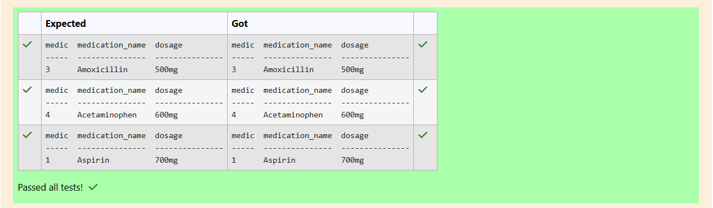

**Question 10**

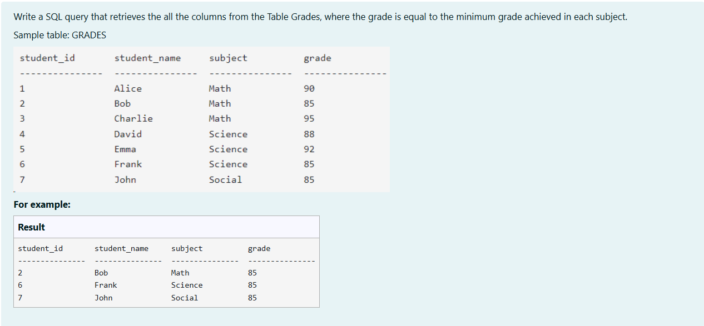

```sql
SELECT *
FROM GRADES g
WHERE grade = (
    SELECT MIN(grade) 
    FROM GRADES
    WHERE subject = g.subject
);
```

**Output:**

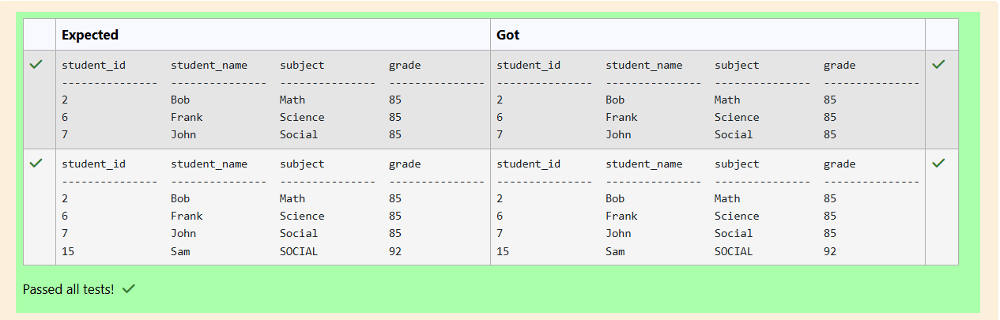

## RESULT
Thus, the SQL queries to implement subqueries and views have been executed successfully.
