# Experiment 6: Joins

## AIM
To study and implement different types of joins.

## THEORY

SQL Joins are used to combine records from two or more tables based on a related column.

### 1. INNER JOIN
Returns records with matching values in both tables.

**Syntax:**
```sql
SELECT columns
FROM table1
INNER JOIN table2
ON table1.column = table2.column;
```

### 2. LEFT JOIN
Returns all records from the left table, and matched records from the right.

**Syntax:**

```sql
SELECT columns
FROM table1
LEFT JOIN table2
ON table1.column = table2.column;
```
### 3. RIGHT JOIN
Returns all records from the right table, and matched records from the left.

**Syntax:**

```sql
SELECT columns
FROM table1
RIGHT JOIN table2
ON table1.column = table2.column;
```
### 4. FULL OUTER JOIN
Returns all records when there is a match in either left or right table.

**Syntax:**

```sql
SELECT columns
FROM table1
FULL OUTER JOIN table2
ON table1.column = table2.column;
```

**Question 1**

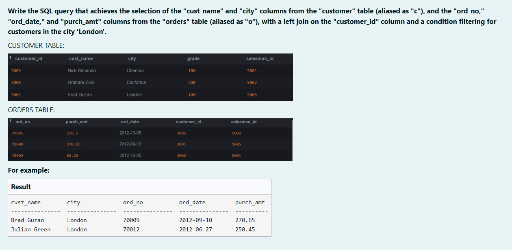

```sql
SELECT 
    c.cust_name,
    c.city,
    o.ord_no,
    o.ord_date,
    o.purch_amt
FROM customer c
LEFT JOIN orders o
ON c.customer_id = o.customer_id
WHERE c.city = 'London';
```

**Output:**

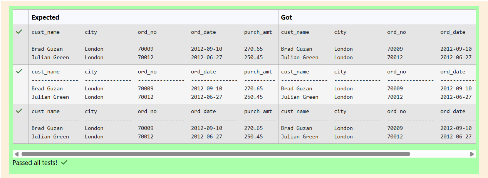

**Question 2**

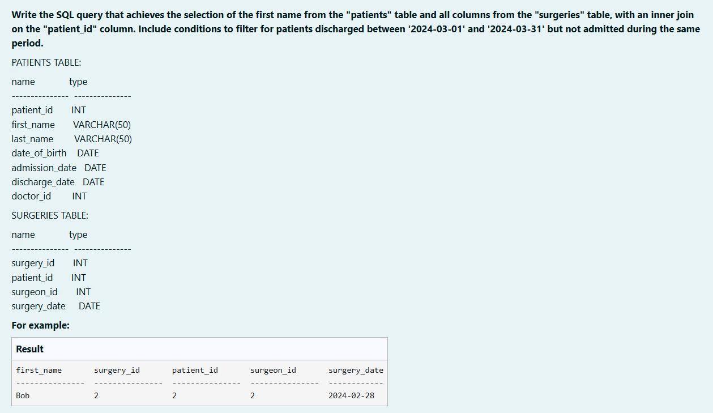

```sql
SELECT 
    p.first_name,
    s.*
FROM patients p
INNER JOIN surgeries s
ON p.patient_id = s.patient_id
WHERE (p.discharge_date BETWEEN '2024-03-01' AND '2024-03-31') AND NOT (p.admission_date BETWEEN '2024-03-01' AND '2024-03-31' );
```

**Output:**

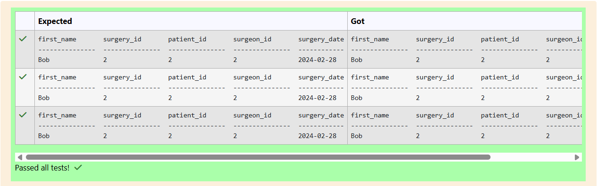


**Question 3**


```sql
SELECT 
    p.*
FROM patients p
INNER JOIN appointments a
ON p.patient_id = a.patient_id
WHERE (a.appointment_date BETWEEN '2024-02-01' AND '2024-02-28');
```

**Output:**

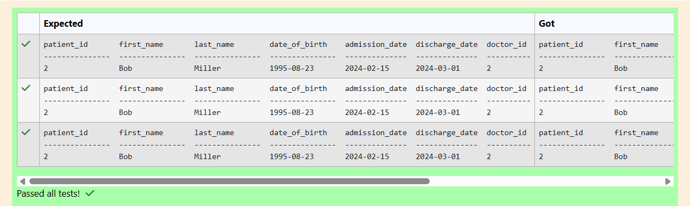

**Question 4**

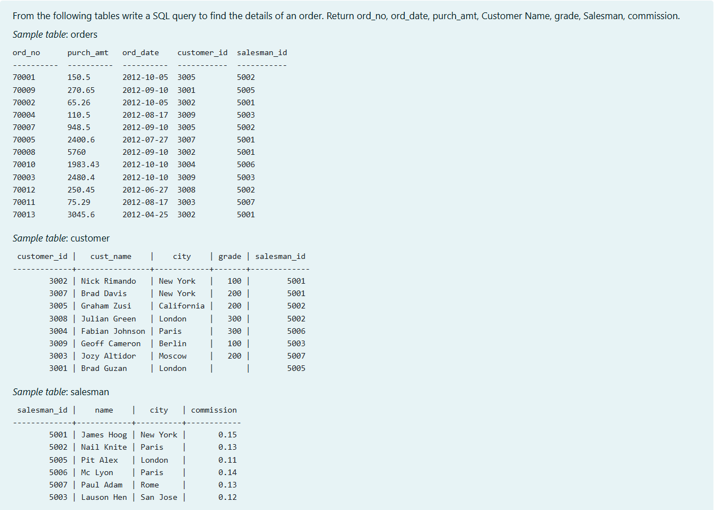

```sql
SELECT 
    o.ord_no,
    o.ord_date,
    o.purch_amt,
    c.cust_name AS "Customer Name",
    c.grade AS "grade",
    s.name AS "Salesman",
    s.commission
FROM orders o
INNER JOIN customer c
ON o.customer_id = c.customer_id
INNER JOIN salesman s
ON o.salesman_id = s.salesman_id;
```

**Output:**

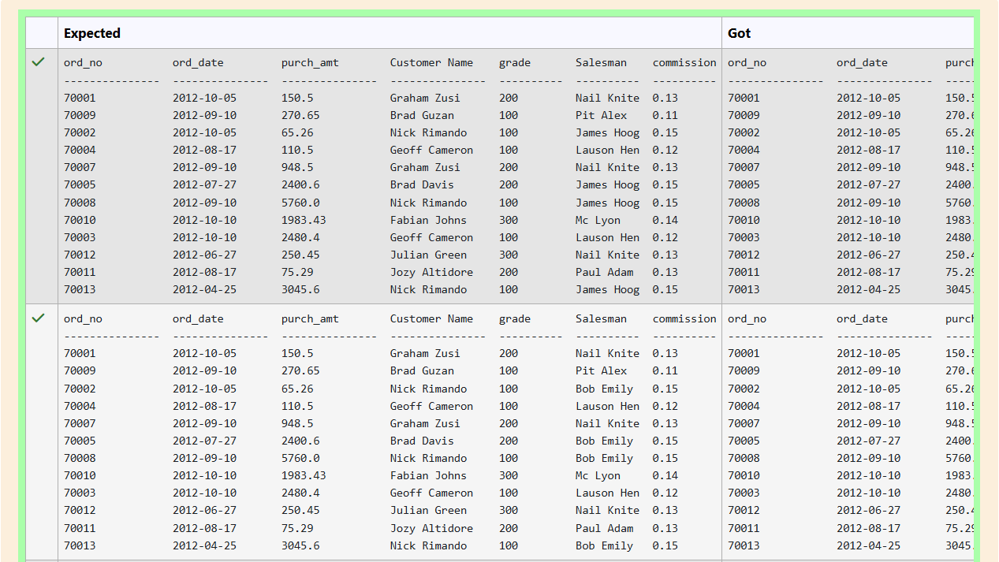

**Question 5**

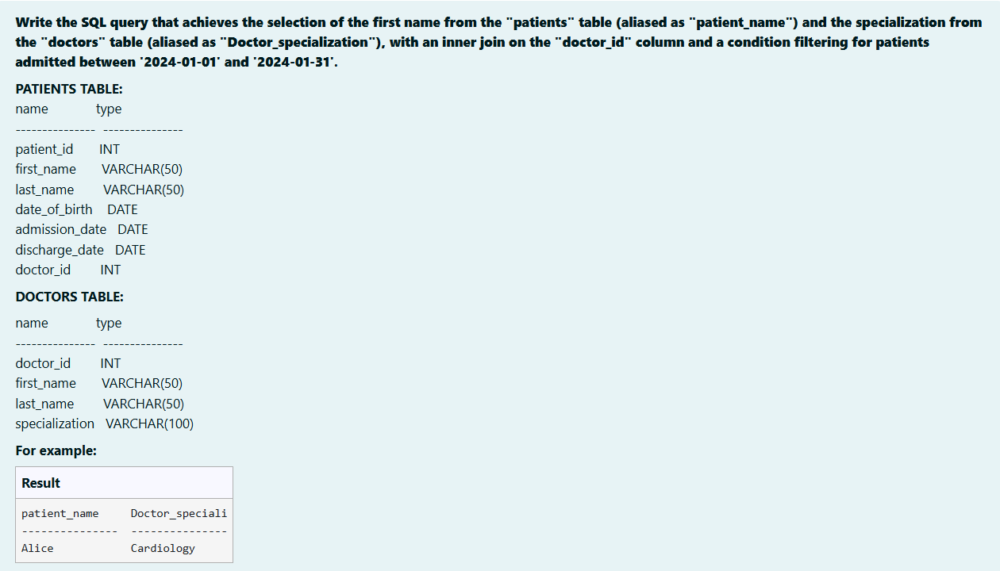

```sql
SELECT
    p.first_name AS "patient_name",
    d.specialization AS "Doctor_speciali"
FROM patients as p
INNER JOIN doctors as d
ON p.doctor_id = d.doctor_id
WHERE p.admission_date BETWEEN '2024-01-01' AND '2024-01-31';
```

**Output:**


**Question 6**

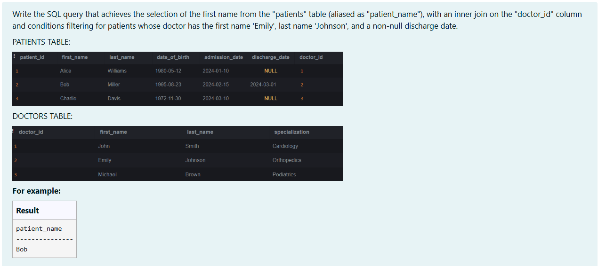

```sql
SELECT
    p.first_name AS "patient_name"
FROM patients AS p
INNER JOIN doctors AS d
ON p.doctor_id = d.doctor_id
WHERE (d.first_name = "Emily" AND d.last_name ="Johnson" AND p.discharge_date IS NOT NULL);
```

**Output:**

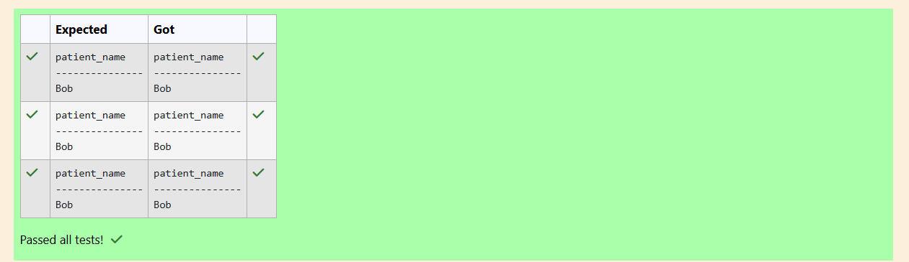

**Question 7**

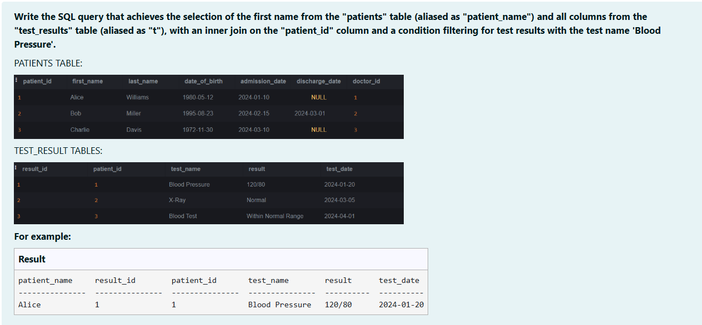

```sql
SELECT
    p.first_name AS "patient_name",
    t.*
FROM patients AS p
INNER JOIN test_results AS t
ON p.patient_id = t.patient_id
WHERE t.test_name = "Blood Pressure";
```

**Output:**

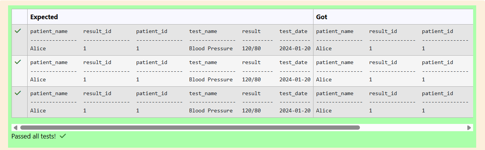

**Question 8**

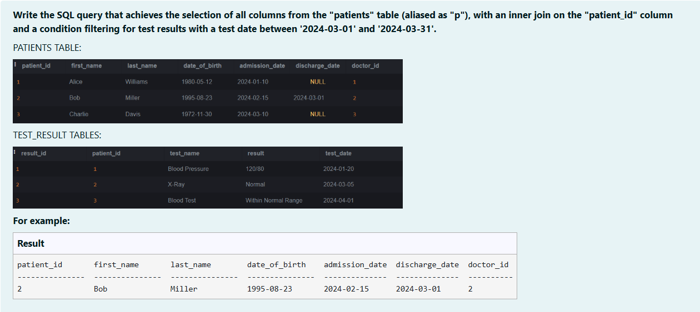

```sql
SELECT 
    p.*
FROM patients as p
INNER JOIN test_results as t
ON p.patient_id = t.patient_id
WHERE t.test_date BETWEEN '2024-03-01' AND '2024-03-31';
```

**Output:**

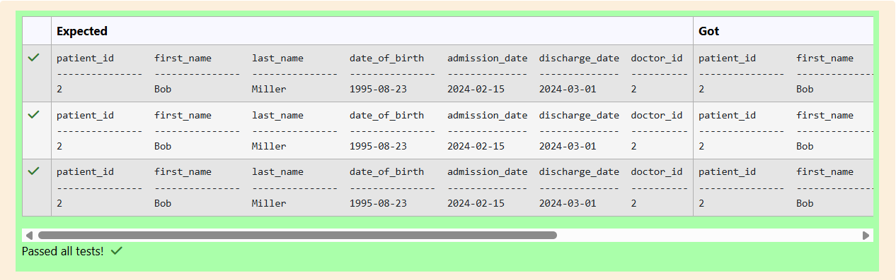

**Question 9**

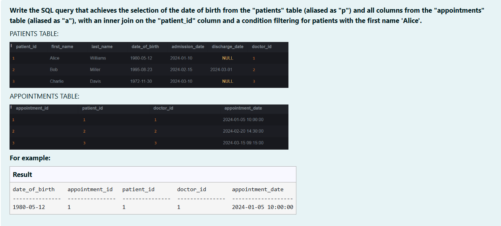

```sql
SELECT 
    p.date_of_birth,
    a.*
FROM patients as p
INNER JOIN appointments as a
ON p.patient_id = a.patient_id
WHERE p.first_name = "Alice";
```

**Output:**

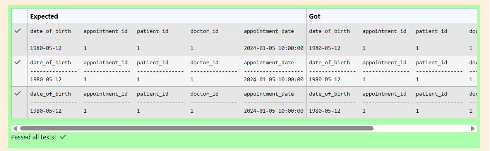

**Question 10**

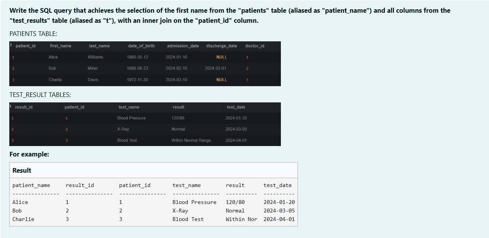

```sql
SELECT
    p.first_name AS "patient_name",
    t.*
FROM patients as p
INNER JOIN test_results as t
ON p.patient_id = t.patient_id;
```

**Output:**

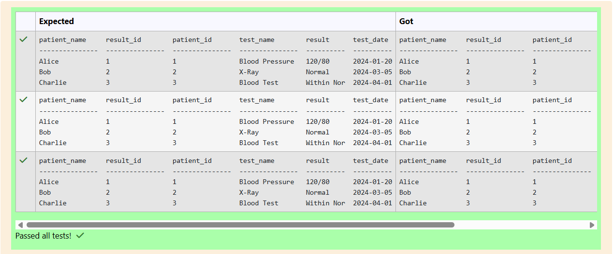

## RESULT
Thus, the SQL queries to implement different types of joins have been executed successfully.
