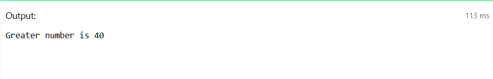
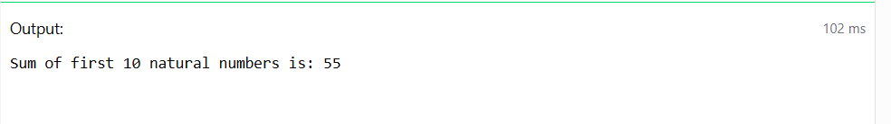
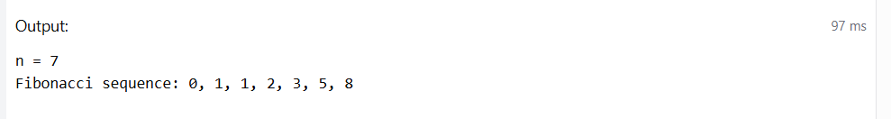
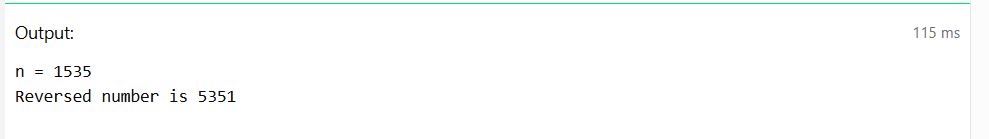
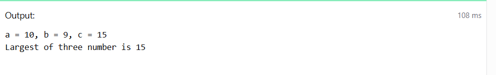

# Experiment 7: PL/SQL – Variables, Control Structures and Loops

## AIM
To write and execute simple PL/SQL programs using variables, loops, and conditional statements.


## THEORY

PL/SQL, which stands for Procedural Language extensions to the Structured Query Language (SQL). It is a combination of SQL along with the procedural features of programming languages.

**Syntax:**
```sql
DECLARE 
   <declarations section> 
BEGIN 
   <executable command(s)>
EXCEPTION 
   <exception handling> 
END;
```

### Basic Components of PL/SQL Block:
- DECLARE: Section to declare variables and constants.
- BEGIN: The execution section that contains PL/SQL statements.
- EXCEPTION: Handles errors or exceptions that occur in the program.
- END: Marks the end of the PL/SQL block.

# PL/SQL Programs – Steps and Expected Output

## 1. Write a PL/SQL program to find the Greatest of Two Numbers

### Steps:
- Declare two numeric variables and initialize them.
- Use an `IF` statement to compare the values.
- Display the greater number using `DBMS_OUTPUT.PUT_LINE`.

**Expected Output:**  
Greater number is: 80

### Program:

```sql
SET SERVEROUTPUT ON;

DECLARE
    num1 NUMBER := 25;
    num2 NUMBER := 40;
    greatest NUMBER;
BEGIN
    IF num1 > num2 THEN
        greatest := num1;
    ELSE
        greatest := num2;
    END IF;
    DBMS_OUTPUT.PUT_LINE('Greater number is ' || greatest);
END;
/

```

### Output:



## 2. Write a PL/SQL program to Calculate Sum of First N Natural Numbers

### Steps:
- Declare a variable `n` and assign a value (e.g., 10).
- Initialize a `sum` variable to 0.
- Use a `WHILE` loop to iterate from 1 to `n`, adding each number to the sum.
- Display the result using `DBMS_OUTPUT.PUT_LINE`.

**Expected Output:**  
Sum of first 10 natural numbers is: 55

### Program:

```sql
SET SERVEROUTPUT ON;

DECLARE
    n NUMBER := 10;   -- upper limit
    i NUMBER := 1;    -- loop counter
    sum NUMBER := 0;  -- accumulator
BEGIN
    WHILE i <= n LOOP
        sum := sum + i;
        i := i + 1;
    END LOOP;

    DBMS_OUTPUT.PUT_LINE('Sum of first ' || n || ' natural numbers is: ' || sum);
END;
/

```

### Output:



## 3. Write a PL/SQL program to generate Fibonacci series

### Steps:
- Declare the variable `n` to indicate how many terms to generate.
- Initialize the first two Fibonacci numbers (0 and 1).
- Use a loop to generate the next terms using the formula `c = a + b`.
- Print each term in the series.

**Expected Output:**  
n = 7  
Fibonacci sequence: 0, 1, 1, 2, 3, 5, 8

### Program:

```sql
SET SERVEROUTPUT ON;

DECLARE
    n NUMBER := 7;   -- number of terms
    a NUMBER := 0;   -- first term
    b NUMBER := 1;   -- second term
    c NUMBER;        -- next term
    i NUMBER := 1;   -- loop counter
    fib_sequence VARCHAR2(200) := ''; -- string to hold sequence
BEGIN
    -- Add first two terms to the sequence
    fib_sequence := fib_sequence || a || ', ' || b;

    -- Generate remaining terms
    WHILE i <= n - 2 LOOP
        c := a + b;
        fib_sequence := fib_sequence || ', ' || c;
        a := b;
        b := c;
        i := i + 1;
    END LOOP;

    DBMS_OUTPUT.PUT_LINE('n = ' || n);
    DBMS_OUTPUT.PUT_LINE('Fibonacci sequence: ' || fib_sequence);
END;
/

```

### Output:




## 4. Write a PL/SQL Program to display the number in Reverse Order

### Steps:
- Declare a variable `n` and assign a value (e.g., 1535).
- Use a loop to extract each digit using modulo and reverse the number.
- Display the reversed number.

**Expected Output:**  
n = 1535  
Reversed number is 5351

### Program:
```sql
SET SERVEROUTPUT ON;

DECLARE
    n NUMBER := 1535;     -- original number
    rev NUMBER := 0;      -- reversed number
    digit NUMBER;         -- to hold each digit
    temp NUMBER;          -- copy of n for processing
BEGIN
    temp := n;

    WHILE temp > 0 LOOP
        digit := MOD(temp, 10);          -- extract last digit
        rev := (rev * 10) + digit;       -- build reversed number
        temp := TRUNC(temp / 10);        -- remove last digit
    END LOOP;

    DBMS_OUTPUT.PUT_LINE('n = ' || n);
    DBMS_OUTPUT.PUT_LINE('Reversed number is ' || rev);
END;
/

```

### Output:



## 5. Write a PL/SQL program to find the largest of three numbers

### Steps:
- Declare three numeric variables `a`, `b`, and `c`.
- Use nested `IF-ELSIF-ELSE` conditions to find the largest among the three.
- Display the largest number.

**Expected Output:**  
a = 10, b = 9, c = 15  
Largest of three number is 15

### Program:
```sql
SET SERVEROUTPUT ON;

DECLARE
    a NUMBER := 10;
    b NUMBER := 9;
    c NUMBER := 15;
    largest NUMBER;
BEGIN
    IF a >= b AND a >= c THEN
        largest := a;
    ELSIF b >= a AND b >= c THEN
        largest := b;
    ELSE
        largest := c;
    END IF;

    DBMS_OUTPUT.PUT_LINE('a = ' || a || ', b = ' || b || ', c = ' || c);
    DBMS_OUTPUT.PUT_LINE('Largest of three number is ' || largest);
END;
/

```

### Output:



## RESULT
Thus, the PL/SQL programs using variables, conditionals, and loops were executed successfully.
